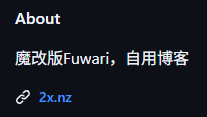
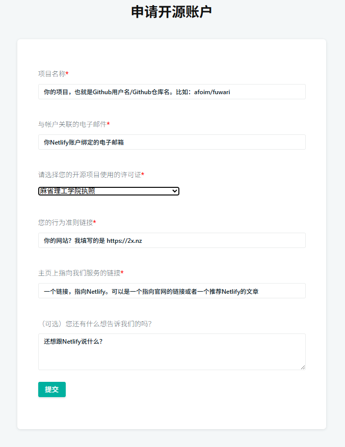
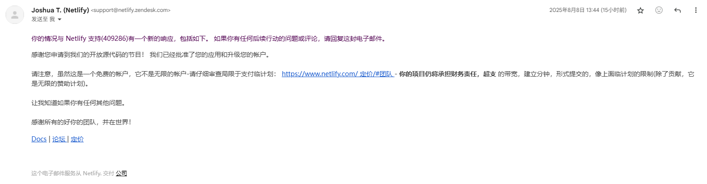
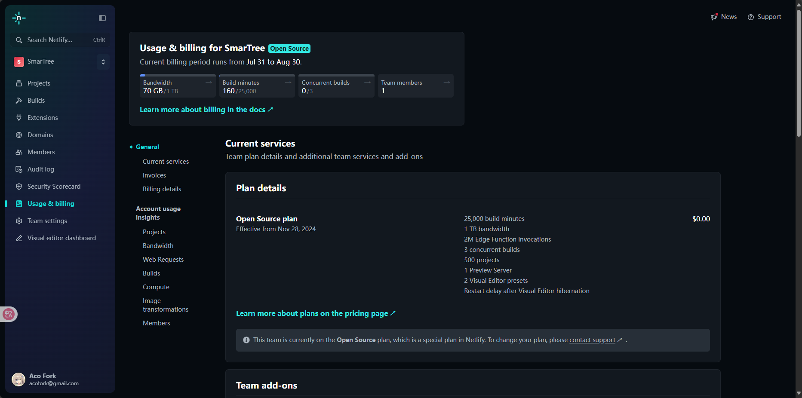

# 申请Netlify
## 正式开始
# [Netlify](https://www.netlify.com)
确保你有一个开源项目，并且已经托管在了Netlify，Github的也有你网站的链接

前往 https://opensource-form.netlify.com/

填写相关信息，提交。

一天后收到已开通 `Open Source` 计划的邮件。如果没有通过也没关系，你可以直接回复这封邮件，带上你的疑问，注意使用英文

账户也自动从 `Starter` 升级到了 `Open Source` 计划

